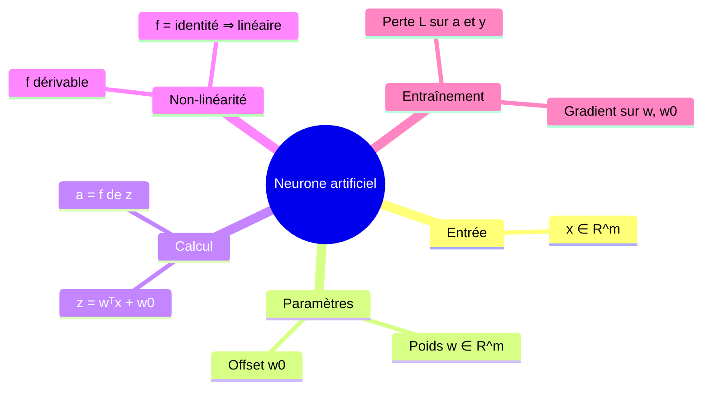
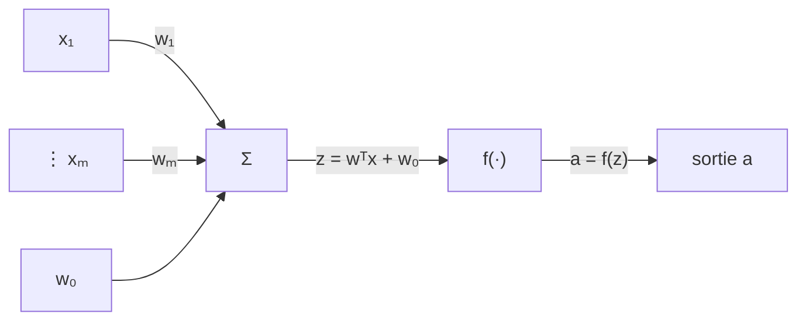

# 01 — Le neurone artificiel : l'élément de base

[[_index|↩ Retour à l'index]]

---

> **Ce qu'on va comprendre**
> - Le neurone artificiel est une fonction **non linéaire** d'un vecteur d'entrée, paramétrée par des **poids** $w$ et un **offset** $w_0$.
> - Son calcul se décompose en deux temps : la **pré-activation** $z = w^T x + w_0$ (combinaison linéaire, comme les classifieurs linéaires qu'on connaît) puis l'**activation** $a = f(z)$ (la non-linéarité qui fait toute la différence).
> - Entraîner un neurone = faire une descente de gradient sur une fonction de perte, exactement comme pour la régression logistique.
> - Deux cas particuliers déjà connus : le classifieur logistique ($f = \sigma$) et le régresseur linéaire ($f = \text{identité}$) sont des neurones.

## 1. Le neurone en un schéma

Un neurone artificiel (aussi appelé « unité » ou « nœud ») transforme un vecteur d'entrée $x \in \mathbb{R}^m$ en un unique nombre $a \in \mathbb{R}$. Il possède des **poids** $(w_1, \dots, w_m)$, un **offset** (ou seuil) $w_0$, et une **fonction d'activation** $f : \mathbb{R} \to \mathbb{R}$ :

Le calcul complet :

$$a = f(z) = f\left(\sum_{j=1}^{m} x_j w_j + w_0\right) = f(w^T x + w_0)$$

**Lecture mot à mot.** D'abord $z$, la **pré-activation** : une combinaison linéaire de l'entrée — exactement le score $w^T x + w_0$ des classifieurs linéaires qu'on a vus (le $\theta$ et le $\theta_0$ d'avant, rebaptisés $w$ et $w_0$). Puis $a$, l'**activation** : on passe $z$ dans $f$. Si $f$ est l'identité, le neurone n'est qu'un modèle linéaire ; si $f$ est une sigmoïde, on retrouve la régression logistique. Tout l'intérêt des réseaux de neurones tient dans les $f$ **non linéaires** — et on ne peut travailler qu'avec des $f$ **dérivables**, puisque l'entraînement reposera sur le gradient.

> ⚠️ Changement de notation assumé par les notes : la dimension d'entrée s'appelait $d$ dans les chapitres précédents, elle s'appelle désormais $m$ (pour coller aux notations usuelles du domaine).

## 2. Entraîner un seul neurone

Entraîner, c'est ajuster $w$ et $w_0$ pour que le neurone fasse de bonnes prédictions. On procède exactement comme pour les modèles linéaires : on se donne une **fonction de perte** $\mathcal{L}(\text{prédiction}, \text{vérité})$ et un jeu de données $\{(x^{(1)}, y^{(1)}), \dots, (x^{(n)}, y^{(n)})\}$, puis on fait une **descente de gradient (stochastique)** pour minimiser

$$J(w, w_0) = \sum_{i} \mathcal{L}\big(NN(x^{(i)}; w, w_0),\; y^{(i)}\big)$$

où $NN(x; w, w_0) = f(w^T x + w_0)$ est la sortie du neurone. Le gradient d'un terme de la somme s'obtient par la règle de chaîne :

$$\frac{\partial \mathcal{L}}{\partial w} = \underbrace{\frac{\partial \mathcal{L}}{\partial a}}_{\text{erreur}}\; \cdot \underbrace{f'(z)}_{\text{pente de } f}\; \cdot \underbrace{x}_{\text{entrée}}, \qquad \frac{\partial \mathcal{L}}{\partial w_0} = \frac{\partial \mathcal{L}}{\partial a} \cdot f'(z) \cdot 1$$

**Comment lire ces deux formules.** L'erreur $\partial \mathcal{L}/\partial a$ dit « combien la perte en veut à la sortie ». On la multiplie par $f'(z)$, la pente locale de l'activation : si $f$ est presque plate en $z$, modifier $w$ ne changera presque rien à $a$, donc le gradient est petit. Enfin on multiplie par l'entrée $x$ : un poids n'est responsable de la sortie qu'à proportion de l'entrée qui le traverse. C'est déjà, en miniature, toute la rétropropagation du chapitre [[04-la-retropropagation|04]].

**Deux cas particuliers familiers.** Le classifieur logistique linéaire avec perte NLL, c'est un neurone avec $f = \sigma$ ; le régresseur linéaire avec perte quadratique, c'est un neurone avec $f = \text{identité}$. Tout ce qu'on a appris sur ces modèles se transporte donc directement.

## 3. Exemple numérique minimal

Neurone à une entrée : $w = 2$, $w_0 = -1$, $f(z) = \sigma(z)$. Pour $x = 1$ : $z = 2 \times 1 - 1 = 1$, $a = \sigma(1) \approx 0{,}73$. Si la vérité est $y = 0$ et qu'on utilise la perte quadratique $\mathcal{L} = (a - y)^2 = 0{,}73^2 \approx 0{,}54$, le gradient vaut $\partial \mathcal{L}/\partial a = 2(a - y) \approx 1{,}46$, $f'(z) = \sigma(z)(1-\sigma(z)) \approx 0{,}197$, donc $\partial \mathcal{L}/\partial w \approx 1{,}46 \times 0{,}197 \times 1 \approx 0{,}29$ et $\partial \mathcal{L}/\partial w_0 \approx 0{,}29$. Un pas de gradient avec $\eta = 0{,}5$ donnerait $w \leftarrow 2 - 0{,}15 = 1{,}85$ et $w_0 \leftarrow -1 - 0{,}15 = -1{,}15$ : le neurone prédira désormais un peu moins haut pour cette entrée — exactement ce qu'on veut.

> **Question d'étude** (PDF) : avec $f(z) = e^z$ et $\mathcal{L}(g, a) = (g - a)^2$, dérive la mise à jour de descente de gradient pour $w$ et $w_0$. → Corrigé dans [[09-exercices-et-corriges|le chapitre 09]].

---

> **À retenir**
> Un neurone = pré-activation linéaire $z = w^T x + w_0$ puis activation $a = f(z)$. L'entraînement est une descente de gradient dont chaque composante du gradient est un produit de trois termes : erreur × pente de $f$ × entrée. Les modèles linéaires classiques sont des neurones particuliers.

[[_index|← Retour à l'index]] | [[02-des-couches-aux-reseaux|Des couches aux réseaux →]]
