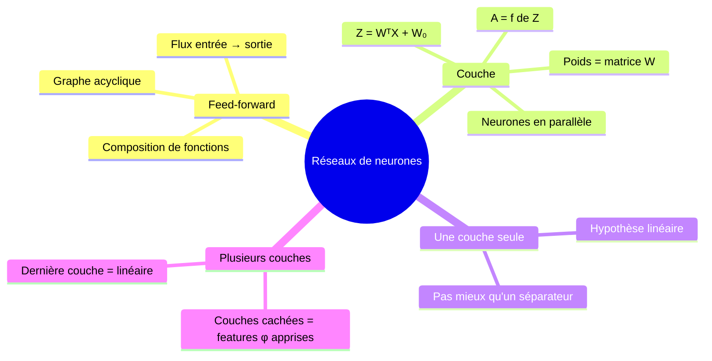
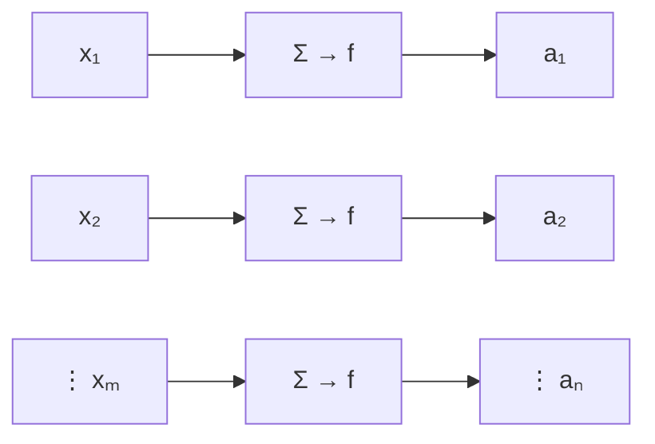
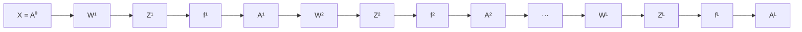

# 02 — Des couches aux réseaux : empiler des neurones

[[_index|↩ Retour à l'index]]

---

> **Ce qu'on va comprendre**
> - Un réseau **feed-forward** est un graphe de calcul **acyclique** : les données circulent des entrées vers les sorties, et la fonction du réseau est une **composition** des fonctions de ses neurones.
> - Une **couche** regroupe des neurones « en parallèle » : leurs poids forment une **matrice** $W$, et le calcul de la couche tient en une ligne : $A = f(W^T X + W_0)$.
> - Une seule couche ne peut produire qu'une hypothèse **linéaire** ; la raison d'être des réseaux profonds est d'**apprendre la transformation de features** $\phi(x)$ plutôt que de la choisir à la main.

## 1. Qu'est-ce qu'un réseau feed-forward ?

Un réseau de neurones prend $x \in \mathbb{R}^m$ et produit $a \in \mathbb{R}^n$. Chaque neurone reçoit en entrée des composantes de $x$ ou des sorties d'autres neurones. Dans un réseau **feed-forward**, on impose que ce graphe de dépendances soit **acyclique** : la sortie d'un neurone ne peut jamais, de proche en proche, influencer sa propre entrée. Les données circulent donc dans un seul sens, et la fonction calculée par le réseau est simplement la **composition** des fonctions calculées par ses neurones :

$$\text{réseau}(x) = f_L\Big(W_L^T \cdots f_2\big(W_2^T f_1(W_1^T x + W_{01}) + W_{02}\big) \cdots \Big)$$

Rien de plus, rien de moins : une grosse fonction composée. Tout l'art sera de calculer sa dérivée efficacement (chapitre [[04-la-retropropagation|04]]).

## 2. La couche : des neurones en parallèle

En principe le graphe pourrait être n'importe quoi (tant qu'il est acyclique), mais pour la simplicité du logiciel et de l'analyse, on organise les neurones en **couches** : une couche est un groupe de neurones qui ne sont pas connectés entre eux, qui reçoivent tous les sorties de la couche précédente et dont les sorties alimentent la suivante. Une couche **entièrement connectée** (fully connected) a $m$ entrées et $n$ sorties :

Comme chaque neurone a son vecteur de poids et son offset, on empile tout dans des matrices et vecteurs :

| Objet | Forme | Signification |
|---|---|---|
| $W$ | $m \times n$ | poids de toute la couche (colonne $j$ = poids du neurone $j$) |
| $W_0$ | $n \times 1$ | offsets de la couche |
| $X$ | $m \times 1$ | entrée (vecteur colonne) |
| $Z = W^T X + W_0$ | $n \times 1$ | pré-activations |
| $A = f(Z)$ | $n \times 1$ | activations, $f$ appliquée **élément par élément** |

**Pourquoi une matrice.** Le neurone $j$ calcule $z_j = \sum_i x_i w_{ij} + w_{0j}$ : c'est exactement le produit matrice-vecteur $W^T X$ (ligne $j$ de $W^T$ contre $X$), plus l'offset. L'écriture matricielle $A = f(W^T X + W_0)$ n'est pas une commodité : c'est ce qui permettra, au chapitre 04, de dériver les gradients de toute une couche d'un seul coup.

**Ce qu'une couche seule peut faire — et ne pas faire.** Une seule couche, avec ou sans sigmoïde en sortie, ne produit qu'une hypothèse **linéaire** : la sigmoïde déforme la valeur de sortie mais la frontière de décision reste une droite (ou un hyperplan). Le passage aux couches multiples change tout : la dernière couche reste un classifieur ou régresseur linéaire, mais les couches précédentes calculent une **transformation de features non linéaire** $\phi(x)$ — apprise des données au lieu d'être choisie à la main comme au temps des noyaux.

## 3. Plusieurs couches : la nomenclature

Avec $L$ couches, on note $l$ l'indice de couche, $m_l$ le nombre d'entrées de la couche $l$ et $n_l$ son nombre de sorties. La matrice $W^l$ est de forme $m_l \times n_l$ et $W_0^l$ de forme $n_l \times 1$. Chaque couche a sa fonction d'activation $f^l$ (en pratique la même au sein d'une couche, quitte à varier d'une couche à l'autre). Le calcul de la couche $l$ :

$$Z^l = W^{l\,T} A^{l-1} + W_0^l, \qquad A^l = f^l(Z^l)$$

avec la convention $A^0 = X$ (l'entrée est « l'activation de la couche 0 »). Voici le réseau complet, chaque couche décomposée en son bloc linéaire (multiplication par $W^l$) et son bloc non linéaire ($f^l$) — décomposition qui structurera toute l'implémentation :

> **Question d'étude** (PDF) : convaincs-toi que toute fonction représentable par un nombre quelconque de couches linéaires (où $f$ est l'identité) est représentable par une seule couche. → Corrigé dans [[09-exercices-et-corriges|le chapitre 09]].

---

> **À retenir**
> Une couche = une matrice $W$ plus un offset $W_0$, en une ligne $A = f(W^T X + W_0)$. Un réseau est une composition de couches ; sans non-linéarité, tout s'effondre en un modèle linéaire unique ; avec des non-linéarités, les couches cachées apprennent la transformation de features $\phi(x)$.

[[01-le-neurone-artificiel|← Le neurone artificiel]] | [[03-les-fonctions-d-activation|Les fonctions d'activation →]]
