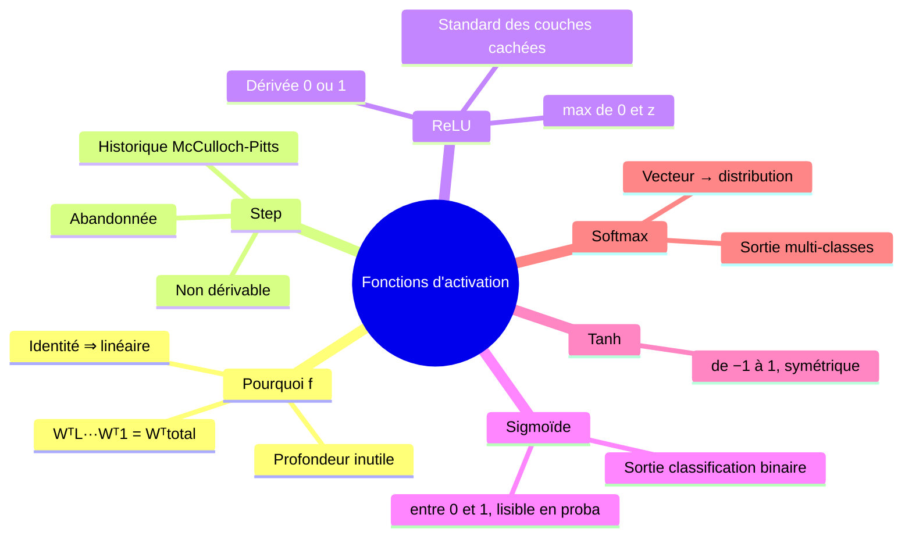
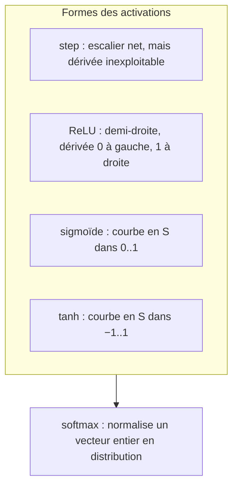

# 03 — Les fonctions d'activation : pourquoi la non-linéarité est vitale

[[_index|↩ Retour à l'index]]

---

> **Ce qu'on va comprendre**
> - Pourquoi $f$ est **indispensable** : avec $f = $ identité, $L$ couches linéaires ne sont qu'**une seule** transformation linéaire $W_{\text{total}}^T X$ — la profondeur n'apporte rien.
> - Les cinq activations du chapitre : **step** (historique, non dérivable), **ReLU**, **sigmoïde**, **tanh**, **softmax** — chacune avec sa forme, sa plage de sortie et son rôle.
> - Où on les met : ReLU dans les couches cachées, sigmoïde en sortie de classification binaire, softmax en sortie multi-classes.

## 1. L'identité ne suffit pas : la preuve par le produit de matrices

Que se passerait-il sans activation, $f(z) = z$ ? En omettant les offsets pour simplifier (ils ne changent pas la conclusion), un réseau à $L$ couches calcule

$$A^L = W^{L\,T} A^{L-1} = W^{L\,T} W^{L-1\,T} \cdots W^{1\,T} X$$

Le produit de matrices est associatif : on peut tout multiplier d'avance en une seule matrice $W_{\text{total}}^T = W^{L\,T} W^{L-1\,T} \cdots W^{1\,T}$, et $A^L = W_{\text{total}}^T X$ est **linéaire** en $X$. Ajouter des couches sans non-linéarité n'augmente donc **pas du tout** la capacité expressive : c'est toujours un modèle linéaire, déguisé. La non-linéarité de $f$ est précisément ce qui fait des réseaux de neurones des approximateurs riches.

## 2. Le catalogue des activations

**Step (marche)** — le choix historique (McCulloch-Pitts, 1943) :

$$\text{step}(z) = \begin{cases} 0 & \text{si } z < 0 \\ 1 & \text{sinon} \end{cases}$$

Sa dérivée est discontinue (nulle partout, infinie en 0) : impossible d'entraîner au gradient. Elle a été remplacée par les activations lisses ci-dessous — qui sont, en un sens, des « marches adoucies ».

**ReLU (rectified linear unit)** — le standard des couches cachées :

$$\text{ReLU}(z) = \max(0, z) = \begin{cases} 0 & \text{si } z < 0 \\ z & \text{sinon} \end{cases}$$

**Sigmoïde** (logistique) — sortie dans $[0, 1]$, lisible comme une **probabilité** :

$$\sigma(z) = \frac{1}{1 + e^{-z}}$$

**Tanh** (tangente hyperbolique) — sortie dans $[-1, 1]$, centrée en 0 :

$$\tanh(z) = \frac{e^z - e^{-z}}{e^z + e^{-z}}$$

**Softmax** — prend un **vecteur** $Z \in \mathbb{R}^n$ et produit une distribution de probabilité sur $n$ classes :

$$\text{softmax}(z)_i = \frac{\exp(z_i)}{\sum_{j} \exp(z_j)}, \qquad \sum_i \text{softmax}(z)_i = 1$$

**Les deux observations du chapitre.** D'abord, la dérivée du ReLU : elle vaut $0$ pour $z < 0$ et $1$ pour $z > 0$ (indéfinie en $z = 0$, où l'on choisit arbitrairement en pratique) — attention, cette dérivée **s'annule** sur tout le demi-axe négatif, ce qui a des conséquences pour l'entraînement (chapitre [[07-optimisation-batches-momentum-adam|07]] : gradients évanescents). Ensuite, la question de la « marche la plus proche » : parmi sigmoïde, ReLU et tanh, la plus proche d'une marche est la sigmoïde ou la tanh — et on peut la **durcir** en la comprimant horizontalement : $\sigma(\beta z)$ avec un grand $\beta$ s'approche d'une marche (le paramètre $\beta$ règle la raideur ; la softmax a la même notion de « température », $\text{softmax}(z/T)$).

## 3. Qui va où ?

Le placement canonique (donné par le chapitre) : **ReLU** dans les couches internes (« cachées »), **sigmoïde** en sortie de classification binaire, **softmax** en sortie de classification multi-classes (le pourquoi exact est l'objet du chapitre [[06-couts-et-activations-assortis|06]] : chaque activation de sortie va avec sa fonction de perte). Pour la régression, la sortie est **linéaire** (pas d'activation de sortie au-delà de l'identité).

> **Questions d'étude** (PDF) : (a) laquelle de sigmoïde, ReLU, tanh ressemble le plus à une marche ? quel paramètre ajouter à la sigmoïde pour l'en rapprocher ? (b) quelle est la dérivée du ReLU ? pour quelles entrées s'annule-t-elle ? → Corrigés dans [[09-exercices-et-corriges|le chapitre 09]].

---

> **À retenir**
> Sans non-linéarité, la profondeur est du théâtre : $L$ couches = une matrice. Le ReLU règne sur les couches cachées (simple, pente 1 là où il agit), la sigmoïde et la softmax convertissent les sorties en probabilités, et chaque activation de sortie doit s'assortir à sa fonction de perte.

[[02-des-couches-aux-reseaux|← Des couches aux réseaux]] | [[04-la-retropropagation|La rétropropagation →]]
