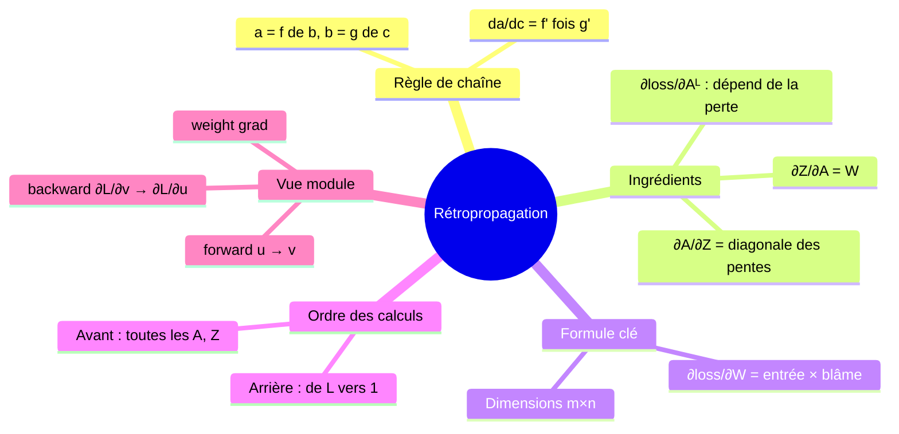
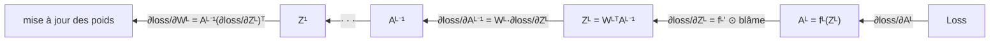

# 04 — La rétropropagation : le cœur des réseaux de neurones

[[_index|↩ Retour à l'index]]

---

> **Ce qu'on va comprendre**
> - Le gradient de la perte par rapport à des milliers de poids semble terrifiant — et se réduit à une **règle de chaîne appliquée méthodiquement de la sortie vers l'entrée**.
> - La formule centrale : $\frac{\partial loss}{\partial W^l} = A^{l-1}\left(\frac{\partial loss}{\partial Z^l}\right)^T$ — le gradient d'une couche est le **produit extérieur** de son entrée par le « blâme » attribué à sa pré-activation.
> - Les trois ingrédients : la dérivée de la perte, $W^l$ (dérivée de $Z^l$ par rapport à $A^{l-1}$), et la matrice **diagonale** des pentes $f^{l'}$ (dérivée de $A^l$ par rapport à $Z^l$).
> - La vision **« propagation du blâme »** : chaque module reçoit sa part de responsabilité, la répartit entre ses entrées, et la renvoie vers l'amont.
> - Un **exemple numérique complet** sur un mini-réseau 1→1→1, tous calculs déroulés.

## 1. Pourquoi ça a l'air terrifiant (et ne l'est pas)

On entraîne par SGD : pour un exemple $(x, y)$, il faut $\nabla_W \mathcal{L}(NN(x; W), y)$ où $W$ désigne **tous** les poids $W^l, W_0^l$ de toutes les couches. Un réseau réaliste a des millions de poids — autant de dérivées partielles ? En fait non : toutes s'obtiennent par une règle de chaîne organisée, et le calcul total coûte à peine plus cher que la prédiction elle-même. C'est la **rétropropagation** (back-propagation), le style d'implémentation de la descente de gradient qui a relancé le domaine dans les années 1980.

Rappel de la règle de chaîne : si $a = f(b)$ et $b = g(c)$, alors

$$\frac{da}{dc} = \frac{da}{db}\cdot\frac{db}{dc} = f'(g(c))\, g'(c)$$

Le réseau étant une composition $X \to Z^1 \to A^1 \to Z^2 \to \dots \to A^L \to \text{loss}$, la dérivée de la perte par rapport à n'importe quel poids est un **produit de dérivées locales** le long du chemin — c'est tout, mais il faut ranger le calcul.

## 2. La formule clé (équation 8.1 des notes)

Partons de la dernière couche. La perte dépend de $W^L$ via la chaîne $W^L \to Z^L \to A^L \to \text{loss}$ :

$$\frac{\partial loss}{\partial W^L} = \underbrace{\frac{\partial loss}{\partial A^L}}_{\text{dépend de la perte}} \cdot \underbrace{\frac{\partial A^L}{\partial Z^L}}_{f^{L'}} \cdot \underbrace{\frac{\partial Z^L}{\partial W^L}}_{A^{L-1}}$$

En écrivant proprement les dimensions, le résultat vaut pour **toute** couche $l$ (équation 8.1) :

$$\frac{\partial loss}{\partial W^l} = A^{l-1} \left(\frac{\partial loss}{\partial Z^l}\right)^T \qquad \text{formes : } (m_l \times 1)\,(1 \times n_l) = m_l \times n_l$$

**Lecture de la formule.** Le gradient de la perte par rapport à la matrice $W^l$ est le produit extérieur de deux choses : l'entrée de la couche, $A^{l-1}$, et le « blâme » $\partial loss/\partial Z^l$ — combien la perte en veut à chaque pré-activation $z^l_j$. Un poids $W^l_{ij}$ (entrée $i$ vers neurone $j$) est donc d'autant plus coupable que son entrée $A^{l-1}_i$ est grande **et** que le neurone $j$ est responsable de la perte. Tout le reste du chapitre sert à calculer ces blâmes de proche en proche.

> Marge des notes : « Il peut te gêner que $\partial Z^L/\partial W^L = A^{L-1}$ — la dérivée d'un vecteur par rapport à une matrice. » C'est une dérivée « par composantes » : $Z^L = W^{L\,T}A^{L-1}$, et $z^L_j$ ne dépend de $W^L_{ij}$ qu'à travers le terme $A^{L-1}_i W^L_{ij}$ — d'où cette écriture informelle mais juste, vérifiable entrée par entrée.

## 3. Les trois ingrédients des blâmes

Pour propager $\partial loss/\partial Z^l$ d'une couche à l'autre, on a besoin de trois quantités (toutes déjà calculables) :

1. $\partial loss/\partial A^L$ — la dérivée de la perte par rapport à la sortie, forme $n_L \times 1$ : elle **dépend de la fonction de perte choisie** (chapitre [[06-couts-et-activations-assortis|06]]).
2. $\partial Z^l/\partial A^{l-1} = W^l$ — forme $m_l \times n_l$ (vérifiable entrée par entrée : $\partial z^l_i/\partial a^{l-1}_j = W^l_{ji}$).
3. $\partial A^l/\partial Z^l$ — forme $n_l \times n_l$, **diagonale** : comme $a^l_i = f^l(z^l_i)$, les dérivées croisées $\partial a^l_i/\partial z^l_j$ sont nulles pour $i \neq j$, et la diagonale porte $f^{l'}(z^l_i)$.

La chaîne complète, de la sortie vers l'entrée (équation 8.3 réécrite en récursif, plus lisible) :

$$\frac{\partial loss}{\partial Z^l} = f^{l'}(Z^l) \odot \Big( W^{l+1} \frac{\partial loss}{\partial Z^{l+1}} \Big)$$

**Lecture.** Le blâme de la couche $l$ se construit en deux gestes : on **renvoie** le blâme de la couche $l+1$ à travers $W^{l+1}$ (chaque neurone amont récupère sa part, pondérée par les poids), puis on le **modère** par la pente locale $f^{l'}(Z^l)$ (là où l'activation est plate, le blâme s'éteint). C'est pour cela que les notes parlent de *blame propagation* : « vous pouvez voir la perte comme notre colère contre la prédiction ; $\partial loss/\partial A^L$ mesure combien on blâme $A^L$ ; le dernier module accepte son blâme, calcule combien en attribuer à chacune de ses entrées, et le leur renvoie. »

## 4. La vue « module » : l'API qui structure tout le code

Le réseau est une alternance de deux types de modules : transformation **linéaire** (matrice de poids) et application **élément par élément** d'une non-linéarité. Chaque module doit fournir trois méthodes (avec $u$ = entrée du module, $v$ = sortie, pour ne pas surcharger les lettres déjà prises) :

- `forward` : $u \to v$ — calculer la sortie, en **mémorisant** $u$ et $v$ (on en aura besoin au retour) ;
- `backward` : $(u, v, \partial \mathcal{L}/\partial v) \to \partial \mathcal{L}/\partial u$ — répartir le blâme reçu vers l'entrée ;
- `weight grad` : $(u, \partial \mathcal{L}/\partial v) \to \partial \mathcal{L}/\partial W$ — seulement pour les modules qui ont des poids.

C'est l'architecture de tous les frameworks modernes (les « autograd »), et l'objet d'un des exercices du cours.

## 5. Exemple numérique complet : réseau 1→1→1

Un seul neurone caché et un seul neurone de sortie, activation sigmoïde partout, perte quadratique, $x = 1$, $y = 0$. Poids : $w^1 = 1$ (entrée→caché), $w^1_0 = 0$ ; $w^2 = 1$ (caché→sortie), $w^2_0 = 0$.

**Passe avant.** $z^1 = 1 \times 1 + 0 = 1$ ; $a^1 = \sigma(1) \approx 0{,}7311$ ; $z^2 = 1 \times 0{,}7311 + 0 = 0{,}7311$ ; $a^2 = \sigma(0{,}7311) \approx 0{,}6749$ ; $\mathcal{L} = (0{,}6749 - 0)^2 \approx 0{,}4555$.

**Passe arrière, couche de sortie.** $\partial \mathcal{L}/\partial a^2 = 2(a^2 - y) = 2 \times 0{,}6749 \approx 1{,}3498$ (la dérivée de la perte). $\sigma'(z) = \sigma(z)(1-\sigma(z))$ donc $\partial a^2/\partial z^2 = 0{,}6749 \times 0{,}3251 \approx 0{,}2194$. Blâme de $z^2$ : $\partial \mathcal{L}/\partial z^2 = 1{,}3498 \times 0{,}2194 \approx 0{,}2962$. Gradient du poids de sortie : $\partial \mathcal{L}/\partial w^2 = a^1 \times 0{,}2962 = 0{,}7311 \times 0{,}2962 \approx 0{,}2166$ — la formule clé en action.

**Passe arrière, couche cachée.** Le blâme revient vers $a^1$ : $\partial \mathcal{L}/\partial a^1 = w^2 \times \partial \mathcal{L}/\partial z^2 = 1 \times 0{,}2962 = 0{,}2962$. On le modère par la pente locale : $\sigma'(1) = 0{,}7311 \times 0{,}2689 \approx 0{,}1966$, donc $\partial \mathcal{L}/\partial z^1 = 0{,}2962 \times 0{,}1966 \approx 0{,}0582$. Et $\partial \mathcal{L}/\partial w^1 = x \times 0{,}0582 = 0{,}0582$.

**Mise à jour** (SGD, $\eta = 0{,}5$) : $w^2 \leftarrow 1 - 0{,}5 \times 0{,}2166 \approx 0{,}892$, $w^1 \leftarrow 1 - 0{,}5 \times 0{,}0582 \approx 0{,}971$. Le réseau vient d'apprendre un peu.

> **Questions d'étude** (PDF) : applique le même raisonnement pour trouver les gradients par rapport à $W_0^l$ ; et que vaut $\partial Z^l/\partial W^l$ ? → Corrigés dans [[09-exercices-et-corriges|le chapitre 09]].

---

> **À retenir**
> Rétropropager = deux passes : avant, on mémorise toutes les $A^l, Z^l$ ; arrière, on calcule $\partial loss/\partial Z^l = f^{l'}(Z^l) \odot (W^{l+1} \cdot \partial loss/\partial Z^{l+1})$ puis $\partial loss/\partial W^l = A^{l-1}(\partial loss/\partial Z^l)^T$. Chaque étape est un produit matrice-vecteur — d'où le coût raisonnable — et chaque module ne connaît que sa dérivée locale.

[[03-les-fonctions-d-activation|← Les fonctions d'activation]] | [[05-entrainement-sgd-et-initialisation|Entraînement SGD →]]
