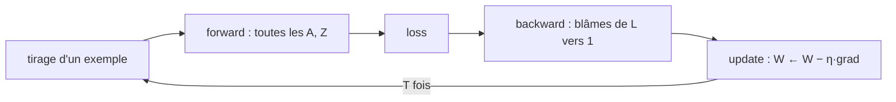

# 05 — Entraînement SGD et initialisation des poids

[[_index|↩ Retour à l'index]]

---

> **Ce qu'on va comprendre**
> - L'algorithme complet **SGD-Neural-Net** : vingt lignes qui assemblent tout ce qu'on a vu — passe avant, rétropropagation, mise à jour.
> - Pourquoi l'initialisation **aléatoire** est obligatoire (briser la symétrie) et pourquoi les poids initiaux doivent être **petits** (rester là où les activations ont une pente non nulle).
> - La stratégie standard : $W^l_{ij} \sim \mathcal{N}(0, 1/m^l)$, $W^l_{0j} \sim \mathcal{N}(0, 1)$ — et ce que ça implique sur la taille initiale des pré-activations.


## 1. L'algorithme complet

Voici le pseudo-code du chapitre, annoté (les commentaires `//` sont ceux des notes) :

```
SGD-Neural-Net(Dn, T, L, (m₁..m_L), (f₁..f_L))
 1  for l = 1 to L
 2      Wᵢⱼˡ  ~ Gaussienne(0, 1/mˡ)      // poids : écart-type 1/√mˡ... voir section 2
 3      W0ⱼˡ  ~ Gaussienne(0, 1)         // offsets : écart-type 1
 4  for t = 1 to T
 5      i = tirage aléatoire dans {1..n}          // un exemple à la fois
 6      A⁰ = x⁽ⁱ⁾
 7      // passe avant : calculer la sortie Aᴸ
 8      for l = 1 to L
 9          Zˡ  = Wˡᵀ Aˡ⁻¹ + W0ˡ
10          Aˡ  = fˡ(Zˡ)
11      loss = Loss(Aᴸ, y⁽ⁱ⁾)
12      for l = L downto 1                       // passe arrière : rétropropagation
13          ∂loss/∂Aˡ  = si l < L alors ∂loss/∂Zˡ⁺¹ · ∂Zˡ⁺¹/∂Aˡ  sinon ∂loss/∂Aᴸ
14          ∂loss/∂Zˡ  = ∂loss/∂Aˡ · ∂Aˡ/∂Zˡ
15          // gradient par rapport aux poids
16          ∂loss/∂Wˡ  = ∂loss/∂Zˡ · ∂Zˡ/∂Wˡ
17          ∂loss/∂W0ˡ = ∂loss/∂Zˡ · ∂Zˡ/∂W0ˡ
18          // mise à jour SGD
19          Wˡ  = Wˡ − η(t) · ∂loss/∂Wˡ
20          W0ˡ = W0ˡ − η(t) · ∂loss/∂W0ˡ
```

**Lecture ligne à ligne.** La boucle des lignes 8-10 est le forward du chapitre [[02-des-couches-aux-reseaux|02]] ; les lignes 12-17 sont le backward du chapitre [[04-la-retropropagation|04]] (la ligne 13 obtient le blâme soit du module aval, soit directement de la perte pour la dernière couche) ; les lignes 19-20 appliquent la descente de gradient. Le pas $\eta(t)$ peut décroître avec le temps — on verra au chapitre [[07-optimisation-batches-momentum-adam|07]] des façons plus fines de le gérer.



## 2. Pourquoi l'initialisation est un vrai problème

L'initialisation ratée est une des causes les plus courantes d'échec d'entraînement. Deux exigences, deux raisons :

**Aléatoire — pour briser la symétrie.** Si tous les poids d'une couche partaient égaux, les neurones de cette couche calculeraient tous la même chose et recevraient des gradients identiques : ils resteraient identiques **pour toujours**. On veut que les différentes parties du réseau s'intéressent à différents aspects du problème — il faut donc des poids différents dès le départ.

**Petits — pour rester sur les pentes.** Beaucoup d'activations (sigmoïde, tanh) ont une pente **quasi nulle** quand $|z|$ est grand. Si les poids initiaux sont grands, les pré-activations $z$ sont grandes, les $f'(z)$ sont minuscules, et les gradients $\partial loss/\partial Z^l = f^{l'}(Z^l) \odot (\dots)$ s'évanouissent : la descente de gradient n'a plus de signal. Des poids initiaux petits maintiennent les $z$ dans la zone de pente utile.

**La règle standard** : chaque poids est tiré d'une gaussienne de moyenne 0 et d'écart-type $1/\sqrt{m^l}$, où $m^l$ est le nombre d'entrées de l'unité — le facteur $1/\sqrt{m^l}$ compense la sommation sur les entrées (sommer $m^l$ termes indépendants d'écart-type $1/\sqrt{m^l}$ donne un écart-type 1, pas $\sqrt{m^l}$). Les offsets suivent $\mathcal{N}(0, 1)$.

**Vérification par l'espérance.** Si l'entrée $x$ est un vecteur de 1, la pré-activation vaut $z = \sum_j w_j + w_0$ : son **espérance** est $0$ (somme de variables centrées), et sa **variance** est $m^l \times (1/m^l) + 1 = 2$. Les pré-activations initiales vivent donc typiquement dans $[-3, +3]$ — précisément la zone où sigmoïde et tanh ont une pente confortable.

> **Questions d'étude** (PDF) : quels termes du pseudo-code dépendent de $f^L$ ? que vaut $\partial Z^l/\partial W^l$ ? quelle est l'espérance de $z$ si $x$ est un vecteur de 1 ? → Corrigés dans [[09-exercices-et-corriges|le chapitre 09]].

---

> **À retenir**
> Entraîner = boucle simple : forward, backward, update. L'initialisation doit être aléatoire (symétrie) et petite (pentes non nulles) ; $W \sim \mathcal{N}(0, 1/\sqrt{m})$ réalise les deux à la fois et garde les pré-activations dans la zone utile des activations.

[[04-la-retropropagation|← La rétropropagation]] | [[06-couts-et-activations-assortis|Coûts et activations →]]
