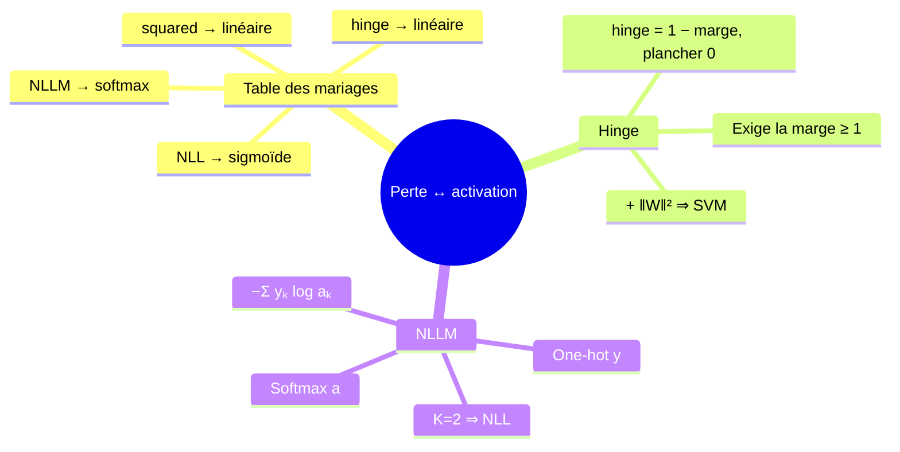
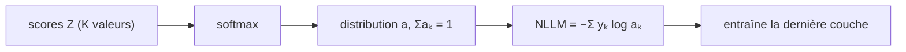

# 06 — Coûts et activations assortis : les bons mariages

[[_index|↩ Retour à l'index]]

---

> **Ce qu'on va comprendre**
> - Une fonction de perte fait des **hypothèses** sur la plage de valeurs qu'elle reçoit : il faut donc assortir la perte de sortie avec l'activation de la dernière couche.
> - Le tableau des mariages : **squared/linéaire** (régression), **hinge/linéaire** (marge), **NLL/sigmoïde** (classification binaire), **NLLM/softmax** (multi-classes).
> - Pourquoi la hinge loss, combinée à une régularisation $\ell_2$, retrouve exactement la **machine à vecteurs de support** (SVM).
> - La **NLLM** généralise la NLL : elle n'est rien d'autre que la NLL écrite avec des vecteurs one-hot et une sortie softmax.

## 1. Pourquoi le mariage compte

Chaque perte part du principe que sa prédiction vit dans une certaine plage : la perte quadratique est conçue pour des valeurs réelles quelconques, la NLL pour des **probabilités** (nombres dans $[0,1]$). Chaque activation de sortie produit une plage : l'identité donne $\mathbb{R}$, la sigmoïde $[0,1]$, la softmax un **simplexe** (vecteur positif sommant à 1). Mésallier les deux — par exemple brancher une NLL sur une sortie linéaire qui peut être négative, où le log est indéfini — casse l'entraînement. Le tableau canonique du chapitre :

| Perte | $f^L$ | Usage |
|---|---|---|
| squared (quadratique) | linéaire | régression |
| hinge | linéaire | classification à marge |
| NLL (log négative) | sigmoïde | classification binaire |
| NLLM (NLL multi-classes) | softmax | classification multi-classes |

## 2. Classification binaire : pourquoi NLL, et d'où vient hinge

La perte naturelle pour classifier est la 0-1 loss — mais sa dérivée est discontinue, donc inutilisable en gradient (on l'a déjà dit au sujet de la step). La **NLL** (negative log likelihood) est lisse et s'étend naturellement au multi-classes : c'est elle qu'on avait utilisée avec la régression logistique — un neurone sigmoïde en sortie, exactement le mariage du tableau.

La **hinge loss** est une autre façon d'adoucir la 0-1 : pour des labels $y \in \{+1, -1\}$ et un score `guess`,

$$\mathcal{L}_h(\text{guess}, \text{actual}) = \max\big(1 - \text{guess}\cdot\text{actual},\; 0\big)$$

**Lecture.** Si le score a le bon signe **et** une magnitude supérieure à 1, la perte est nulle ; sinon elle vaut la distance à cette exigence. Elle n'exige donc pas seulement d'avoir raison, mais d'avoir raison **avec marge**. Et le lien historique fort : hinge loss + régularisateur de norme carrée = exactement le problème du **SVM** — la méthode qui dominait avant la renaissance des réseaux de neurones, grâce à sa forme quadratique facile à optimiser. Les réseaux de neurones l'ont intégrée comme simple perte de sortie.

## 3. Multi-classes : NLLM et softmax

Avec $K$ classes, le label d'entraînement devient un vecteur **one-hot** $y = [y_1, \dots, y_K]^T$ ($y_k = 1$ pour la vraie classe). La dernière couche utilise la **softmax**, donc la sortie $a = [a_1, \dots, a_K]^T$ est une distribution sur les classes : $a_k$ = probabilité prédite de la classe $k$. La probabilité que le réseau attribue à la **bonne** classe est $\prod_k a_k^{y_k}$, et le log de cette probabilité est $\sum_k y_k \log a_k$ (seul le terme de la vraie classe survit, le one-hot agissant comme sélecteur). La perte NLLM est l'opposé :

$$\mathcal{L}_{nllm}(\text{guess}, \text{actual}) = -\sum_{k=1}^{K} \text{actual}_k \cdot \log(\text{guess}_k)$$

C'est la NLL, version vectorielle. Le cas $K = 2$ retombe exactement sur la NLL binaire : avec $y_2 = 1 - y_1$ et $a_2 = 1 - a_1$ (softmax à deux classes = sigmoïde), on obtient $-\big(y_1 \log a_1 + (1-y_1)\log(1-a_1)\big)$ — la NLL sigmoïde classique.

> **Question d'étude** (PDF) : montre que $\mathcal{L}_{nllm}$ pour $K = 2$ est la même chose que $\mathcal{L}_{nll}$. → Corrigé dans [[09-exercices-et-corriges|le chapitre 09]].

---

> **À retenir**
> squared/linéaire pour régresser, NLL/sigmoïde pour classifier en binaire, NLLM/softmax en multi-classes, hinge/linéaire quand on veut une marge (et, avec $\ell_2$, un SVM). Une perte et une activation de sortie incohérentes entre elles sabotent l'entraînement avant même la première itération.

[[05-entrainement-sgd-et-initialisation|← Entraînement SGD]] | [[07-optimisation-batches-momentum-adam|Optimisation avancée →]]
