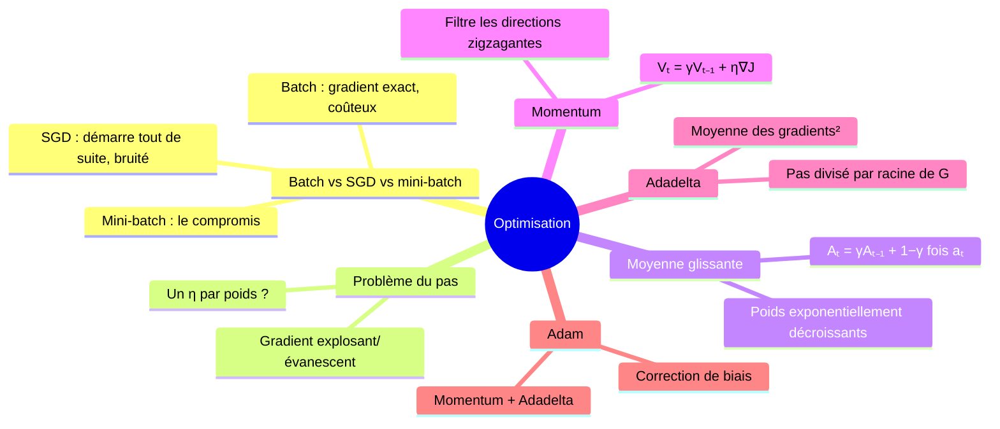
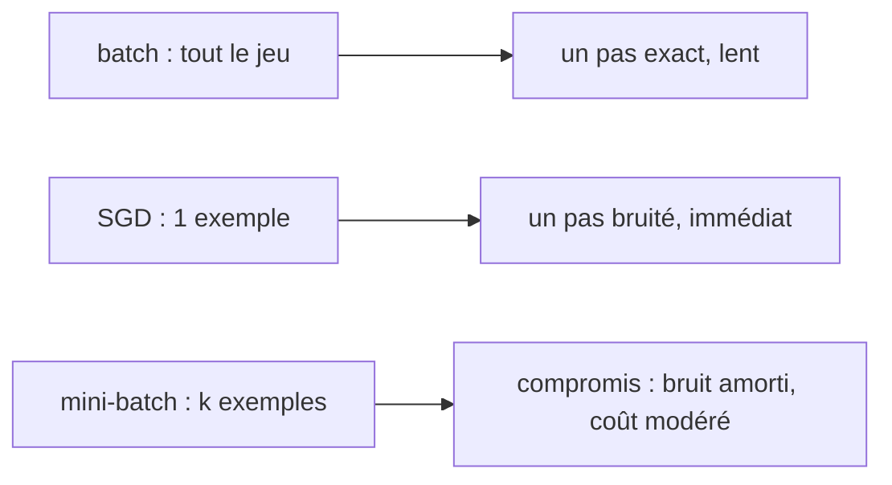
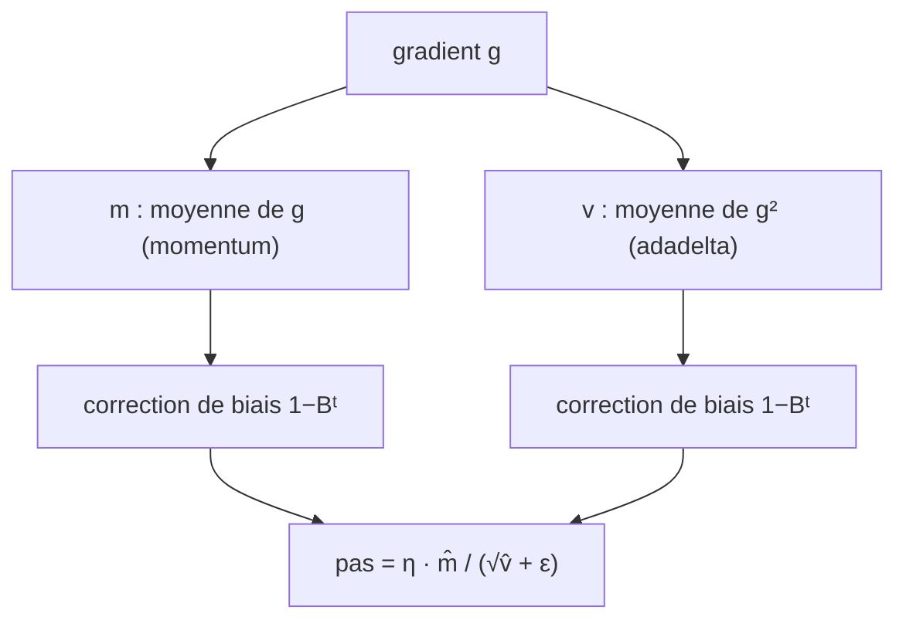

# 07 — Optimisation : batches, momentum, Adadelta, Adam

[[_index|↩ Retour à l'index]]

---

> **Ce qu'on va comprendre**
> - L'objectif $J(W) = \sum_i \mathcal{L}(h(x^{(i)}; W), y^{(i)})$ est une **somme** : on peut l'utiliser par morceaux — tout (batch), un point (SGD), ou un petit groupe (**mini-batch**, le compromis standard).
> - Pourquoi un pas $\eta$ **unique pour tous les poids** est insuffisant : le gradient rétropropagé est multiplié par toutes les matrices du réseau et peut **exploser ou s'évanouir** selon la couche.
> - Les moyennes glissantes, brique de base des méthodes adaptatives ; le **momentum** (moyenne des gradients = amortisseur des zigzags), **Adadelta** (pas petit en terrain pentu, grand en terrain plat), et **Adam** (la synthèse, devenue le défaut).



## 1. Batch, stochastique, mini-batches : la somme découpée en tranches

L'objectif est une somme sur les $n$ exemples :

$$J(W) = \sum_{i=1}^{n} \mathcal{L}(h(x^{(i)}; W), y^{(i)})$$

**Batch gradient descent** : on somme le gradient de **tous** les exemples, puis un pas : $W := W - \eta \nabla_W J(W)$. C'est le gradient exact — mais avant de faire un seul pas, il faut traverser tout le jeu de données, ce qui est prohibitif quand $n$ est grand.

**SGD (stochastic gradient descent)** : on tire un exemple au hasard et on fait le pas sur lui seul : $W := W - \eta \nabla_W \mathcal{L}(h(x^{(i)}; W), y^{(i)})$. On démarre immédiatement et on progresse souvent très vite ; en revanche, si les exemples sont hétérogènes, les pas partent dans des directions qui se combattent et il faut un $\eta$ petit pour moyenner. (Tirage uniforme + décroissance adéquate de $\eta$ ⇒ convergence garantie en probabilité vers au moins un optimum local.)

**Mini-batch** : le compromis efficace, adopté par la quasi-totalité des logiciels. On tire $k$ points **distincts** uniformément et on fait le pas sur leur contribution :

$$W := W - \eta \sum_{i=1}^{k} \nabla_W \mathcal{L}(h(x^{(i)}; W), y^{(i)})$$

Les deux cas extrêmes : $k = 1$ = SGD, $k = n$ = batch. Tirage sans remise + remélange :

```
MINI-BATCH-SGD(NN, data, k)
 1  n = length(data)
 2  while not done
 3      RANDOM-SHUFFLE(data)
 4      for i = 1 to n/k
 5          BATCH-GRADIENT-UPDATE(NN, data[(i−1)k : ik])
```



## 2. Pourquoi un seul $\eta$ ne suffit pas

Choisir $\eta$ est déjà difficile (trop petit : convergence lente ; trop grand : divergence ou oscillations). Mais il y a pire : dans un réseau profond, le gradient de la **dernière** couche et celui de la **première** peuvent avoir des ordres de grandeur très différents. La raison est dans l'équation de rétropropagation (chapitre [[04-la-retropropagation|04]]) : le blâme est multiplié, couche après couche, par toutes les matrices $W^{l+1}$ et modéré par toutes les pentes $f^{l'}$. Si ces facteurs valent typiquement $> 1$ (poids grands), le gradient **explose** en remontant ; s'ils valent $< 1$ (pentes plates, poids petits), il **s'évanouit**. Un pas unique pour tout le monde est condamné. D'où l'idée : **un pas adaptatif par poids**, piloté par l'historique local de ses gradients.

## 3. La brique : la moyenne glissante

Pour une suite $a_1, a_2, \dots$, la moyenne glissante est $A_0 = 0$, $A_t = \gamma_t A_{t-1} + (1 - \gamma_t) a_t$ avec $\gamma_t \in (0,1)$. Si $\gamma$ est constant, en déroulant la récurrence :

$$A_T = \sum_{t=0}^{T} \gamma^{T-t} (1-\gamma)\, a_t$$

Les coefficients $\gamma^{T-t}(1-\gamma)$ **décroissent exponentiellement** vers le passé : l'observation la plus récente pèse $(1-\gamma)$, la précédente $\gamma(1-\gamma)$, etc. C'est une mémoire à oubli exponentiel — parfaite pour estimer « comment vont les choses ces derniers temps ». (Cas particulier : $\gamma_t = (t-1)/t$ redonne la moyenne ordinaire.)

## 4. Momentum : amortir les zigzags

Si les gradients récents oscillent dans une direction, leurs contributions s'annulent en moyenne : on veut retirer cette composante du mouvement. Le momentum garde une moyenne des gradients :

$$V_0 = 0, \qquad V_t = \gamma V_{t-1} + \eta \nabla_W J(W_{t-1}), \qquad W_t = W_{t-1} - V_t$$

En posant $\eta = \eta'(1-\gamma)$, c'est exactement faire un pas de taille $\eta'$ sur la **moyenne glissante** des gradients de paramètre $\gamma$ : $M_t = \gamma M_{t-1} + (1-\gamma)\nabla_W J(W_{t-1})$, $W_t = W_{t-1} - \eta' M_t$ (les deux formulations sont équivalentes : $V_t = \eta M_t$). Résultat : $V_t$ est grand dans les dimensions où le gradient garde le même signe (on accélère), petit là où il change sans cesse (on filtre). $\gamma$ typique : 0,9.

## 5. Adadelta : adapter le pas au terrain

Idée complémentaire : prendre de **grands pas là où la surface est plate** (aucun risque de sauter trop loin) et de **petits pas là où elle est pentue** — et ceci **pour chaque poids séparément**. Pour le poids $j$ :

$$g_{t,j} = \nabla_W J(W_{t-1})_j, \qquad G_{t,j} = \gamma G_{t-1,j} + (1-\gamma) g_{t,j}^2, \qquad W_{t,j} = W_{t-1,j} - \frac{\eta}{\sqrt{G_{t,j} + \epsilon}}\, g_{t,j}$$

$G_{t,j}$ est la moyenne glissante du **carré** du gradient (le carré rend la mesure insensible au signe : on veut la **magnitude**). Le dénominateur $\sqrt{G_{t,j} + \epsilon}$ est grand quand la direction $j$ est pentue → pas réduit ; petit quand elle est plate → pas amplifié. ($\epsilon$ minuscule évite la division par zéro.)

## 6. Adam : la synthèse devenue standard

Adam combine momentum (direction persistante) et Adadelta (pas adapté à la pente). Pour le poids $j$ :

$$m_{t,j} = B_1 m_{t-1,j} + (1-B_1) g_{t,j}, \qquad v_{t,j} = B_2 v_{t-1,j} + (1-B_2) g_{t,j}^2$$

**Le piège du démarrage.** Initialisées à $m_0 = v_0 = 0$, ces moyennes partent **biaisées vers le bas** : à $t = 1$, $m_1 = (1-B_1)g_1$ ne vaut que 0,1 % du gradient si $B_1 = 0{,}9$. On corrige en divisant par la masse des coefficients non nuls — en développant $m_t$ en termes des $g_i$, les coefficients somment à $1 - B_1^t$ (car $m_0 = 0$), d'où :

$$\hat{m}_{t,j} = \frac{m_{t,j}}{1 - B_1^t}, \qquad \hat{v}_{t,j} = \frac{v_{t,j}}{1 - B_2^t}, \qquad W_{t,j} = W_{t-1,j} - \frac{\eta}{\sqrt{\hat{v}_{t,j} + \epsilon}}\, \hat{m}_{t,j}$$

Valeurs préconisées par les auteurs : $B_1 = 0{,}9$, $B_2 = 0{,}999$, $\epsilon = 10^{-8}$ — et bonne nouvelle, Adam n'est pas sensible à de petits écarts autour de ces valeurs. En implémentation : une matrice par quantité ($m^l, v^l, g^l, g^{2l}$) et par couche.



> **Questions d'étude** (PDF) : pour quelle valeur de $k$ le mini-batch redevient-il SGD ? batch ? — prouve que $\gamma_t = (t-1)/t$ donne la moyenne ordinaire — les deux formulations du momentum sont-elles équivalentes ? — $\gamma = 0{,}1$ donne-t-il plus ou moins d'effet de momentum que $\gamma = 0{,}9$ ? — si on écrit $\hat{m}_j$ directement comme moyenne glissante des $g_{t,j}$, quel est le paramètre de décroissance ? → Corrigés dans [[09-exercices-et-corriges|le chapitre 09]].

---

> **À retenir**
> Mini-batches = le juste milieu entre batch et SGD. Les gradients explosent ou s'évanouissent selon la couche, donc un pas par poids, adapté à l'historique local : moyenne glissante → momentum (direction) et Adadelta (magnitude) → Adam, la combinaison avec correction de biais, qui est aujourd'hui le réglage par défaut.

[[06-couts-et-activations-assortis|← Coûts et activations]] | [[08-la-regularisation|La régularisation →]]
