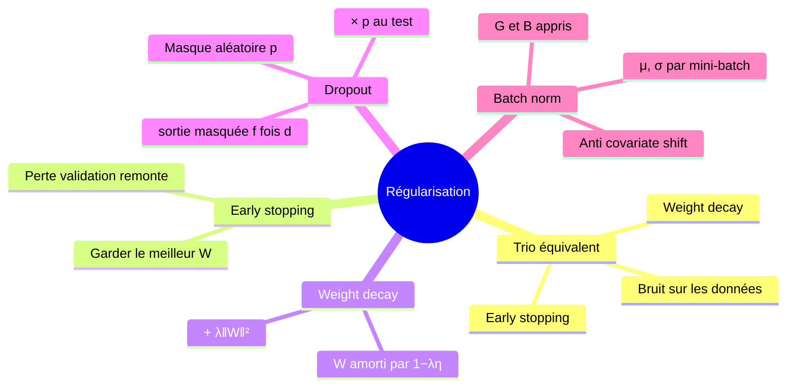
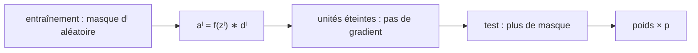

# 08 — La régularisation : early stopping, weight decay, dropout, batch norm

[[_index|↩ Retour à l'index]]

---

> **Ce qu'on va comprendre**
> - Paradoxe pragmatique : les grands réseaux modernes surapprennent moins que la théorie ne le laissait prévoir — mais les outils de régularisation restent indispensables.
> - Un trio aux effets équivalents (résultat de Bishop) : **early stopping**, **weight decay**, et **ajout de bruit** aux données — trois façons de faire la même chose, chacune avec sa mécanique propre.
> - **Dropout** : au lieu de perturber les données, on perturbe le **réseau** — chaque unité est éteinte avec probabilité $p$ pendant l'entraînement, ce qui force une responsabilité collective.
> - **Batch normalization** : standardiser les entrées de chaque couche par mini-batch, avec deux poids appris $G, B$ pour ne pas imposer une normalisation trop rigide.

## 1. Le paysage : pourquoi régulariser (encore)

Jusqu'ici on minimisait la perte d'entraînement pure. Risque : le surapprentissage. Le fait pragmatique — contre-intuitif et encore mal compris théoriquement — est que les réseaux profonds actuels, très grands et entraînés sur énormément de données, surapprennent peu. La compréhension de ce phénomène est un domaine de recherche actif. Les stratégies de régularisation restent néanmoins importantes, et le chapitre en présente trois familles.

## 2. Le trio équivalent à la régression ridge

Ces trois méthodes ont, au fond, le même effet (résultat de Bishop) :

**Early stopping (arrêt précoce).** À chaque époque (passe complète sur le jeu d'entraînement — ou plus souvent), évaluer la perte du $W$ courant sur un **jeu de validation**. Courbe typique : la perte d'entraînement descend régulièrement, la perte de validation descend d'abord puis **remonte** — le réseau a commencé à mémoriser les détails du jeu d'entraînement. On s'arrête dès que la perte de validation remonte systématiquement, et on rend le $W$ qui avait le meilleur score de validation. Le plus simple à implémenter, d'usage courant.

**Weight decay (décroissance des poids).** On pénalise la norme de tous les poids, comme en ridge : $J(W) = \sum_i \mathcal{L}(NN(x^{(i)}), y^{(i)}; W) + \lambda \|W\|^2$. La mise à jour de gradient devient

$$W_t = W_{t-1} - \eta\Big(\nabla_W \mathcal{L}(NN(x^{(i)}), y^{(i)}; W_{t-1}) + \lambda W_{t-1}\Big) = W_{t-1}(1 - \lambda\eta) - \eta\,\nabla_W \mathcal{L}(\dots)$$

Lecture : à chaque pas, on **amortit** d'abord $W_{t-1}$ d'un facteur $(1-\lambda\eta)$ — d'où le nom — puis on fait le pas de gradient. Les poids sont poussés en permanence vers zéro ; seuls ceux que les données justifient vraiment résistent.

**Bruit sur les données.** Même effet, troisième mécanique : avant chaque calcul de gradient, perturber légèrement les $x^{(i)}$ avec un petit bruit gaussien centré. Si les données changent un peu à chaque pas, le réseau ne peut plus exploiter les valeurs exactes des exemples — il doit capturer la structure générale.

## 3. Dropout : perturber le réseau, pas les données

Idée : au lieu de brouiller les données, brouillons le **réseau**. À chaque pas d'entraînement, on tire au sort, pour chaque unité de chaque couche, avec probabilité $p$ : l'unité est **désactivée** — sa sortie est mise à 0. Elle ne contribue ni à la sortie ni à son gradient (son blâme est coupé à la source : voir le corrigé du chapitre [[09-exercices-et-corriges|09]]). Conséquence profonde : aucune unité ne peut se reposer sur un petit groupe de collègues — toutes doivent porter une « responsabilité collective » de la prédiction, ce qui rend le réseau plus robuste aux perturbations des données.

**Implémentation (triviale).** À l'entraînement, dans le forward : $a^l = f(z^l) * d^l$, où $*$ est le produit composante par composante et $d^l$ un vecteur aléatoire de 0/1 (1 avec probabilité $p$). Le backward s'appuie sur $a^l$ et ne change pas — la chaîne de dérivation propage automatiquement les zéros du masque. **Au test**, on ne désactive plus rien : on multiplie tous les poids par $p$, pour retrouver les niveaux d'activation moyens de l'entraînement. $p = 0{,}5$ est le réglage usuel, à expérimenter.

## 4. Batch normalization : standardiser l'intérieur du réseau

Motivation : le **covariate shift**. Considérons la 2e couche d'un réseau : la distribution de ses entrées change au cours de l'entraînement, puisque les poids de la 1re couche changent. Apprendre sur une distribution mouvante est doublement difficile : il faut ajuster les poids pour mieux prédire, mais aussi pour compenser la dérive des entrées. (Si la magnitude des entrées croît avec le temps, les poids doivent décroître juste pour maintenir les prédictions.)

**Le remède** : standardiser, pour chaque mini-batch, les entrées de chaque couche — soustraire la moyenne et diviser par l'écart-type, par dimension, exactement comme la standardisation classique des données :

$$\mu^l_i = \frac{1}{K}\sum_{j=1}^{K} Z^l_{ij}, \qquad \sigma^l_i = \sqrt{\frac{1}{K}\sum_{j=1}^{K}(Z^l_{ij} - \mu_i)^2}, \qquad \hat{Z}^l_{ij} = \frac{Z^l_{ij} - \mu^l_i}{\sigma^l_i + \epsilon}$$

**Mais** imposer exactement moyenne 0 et écart-type 1 à chaque couche est trop rigide — on donnerait des ordres au réseau au lieu de le laisser choisir. On ajoute donc **deux poids appris par dimension** : $G^l$ (échelle) et $B^l$ (décalage), et la sortie finale du module est

$$\tilde{Z}^l_{ij} = G^l_i \hat{Z}^l_{ij} + B^l_i$$

**En vue module.** La batch norm est un module intercalé entre la multiplication par $W^l$ et l'activation $f^l$ : il reçoit $Z^l$ et produit $\tilde{Z}^l$. Son backward doit calculer $\partial L/\partial Z^l$ (pour la rétropropagation vers l'amont) et $\partial L/\partial G^l$, $\partial L/\partial B^l$ (pour ses propres poids). Pour $B_i$ (qui contribue à $\tilde{Z}_{ij}$ pour tous les points $j$ du batch) : $\partial L/\partial B_i = \sum_j \partial L/\partial \tilde{Z}_{ij}$ ; pour $G_i$ : $\partial L/\partial G_i = \sum_j (\partial L/\partial \tilde{Z}_{ij})\,\hat{Z}_{ij}$. Pour $Z$, la chaîne complète à travers la standardisation donne (résultat final du chapitre) :

$$\frac{\partial L}{\partial Z_{ij}} = \sum_{k=1}^{K} \frac{\partial L}{\partial \tilde{Z}_{ik}} \, G_i \, \frac{1}{K\sigma_i}\left( \delta_{jk}K - 1 - \frac{(Z_{ik} - \mu_i)(Z_{ij} - \mu_i)}{\sigma_i^2} \right)$$

**Lecture de la formule sans la réciter.** Chaque $Z_{ij}$ influence $\mu_i$ et $\sigma_i$ du batch, donc toutes les sorties normalisées $\tilde{Z}_{ik}$ — d'où la somme sur $k$. Le terme $\delta_{jk}K - 1$ vient de la dépendance directe (seul $k = j$ dépend de $Z_{ij}$) moins la dépendance via la moyenne (chacun des $K$ points pèse $1/K$ dans $\mu$) ; le dernier terme corrige pour la dépendance via $\sigma$. L'essentiel à retenir : c'est un module de plus avec un forward et un backward bien définis, et il **régularise** pour la même raison que le bruit et le dropout — chaque mini-batch est légèrement perturbé par la standardisation, ce qui empêche le réseau d'exploiter des valeurs trop particulières.

> **Question d'étude** (PDF) : assure-toi de comprendre pourquoi, en SGD, mettre une activation à 0 (dropout) empêche la mise à jour des poids de l'unité ce coup-ci. → Corrigé dans [[09-exercices-et-corriges|le chapitre 09]].

---

> **À retenir**
> Early stopping surveille la validation, weight decay amortit les poids, le bruit brouille les données — trois formes du même effet ridge. Dropout éteint aléatoirement des unités à l'entraînement (et multiplie les poids par $p$ au test) ; la batch norm standardise l'intérieur du réseau par mini-batch avec deux poids appris $G, B$, soignant le covariate shift et régularisant au passage.

[[07-optimisation-batches-momentum-adam|← Optimisation avancée]] | [[09-exercices-et-corriges|Exercices et corrigés →]]
