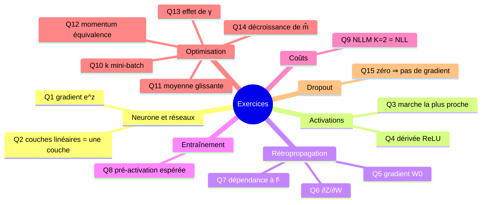

# 09 — Exercices et corrigés

[[_index|↩ Retour à l'index]]

---

> **Ce qu'on va comprendre**
> - Les **15 questions d'étude** du chapitre 8 des notes, corrigées pas à pas : dérivations de gradients, preuves par récurrence, équivalences de formulations, interprétations.
> - L'habitude à prendre : **tenter chaque question soi-même avant de lire le corrigé** — c'est le seul moment où l'entraînement se produit vraiment.

## Q1 — Gradient pour $f(z) = e^z$ et perte quadratique

**Énoncé.** Un seul neurone, $f(z) = e^z$, perte $\mathcal{L}(g, a) = (g - a)^2$. Dérive la mise à jour de descente de gradient pour $w$ et $w_0$.

**Corrigé.** Sortie : $a = e^{w^T x + w_0}$. Par la règle de chaîne :

$$\frac{\partial \mathcal{L}}{\partial a} = -2(g - a) = 2(a - g), \qquad \frac{\partial a}{\partial w} = a \cdot x, \qquad \frac{\partial a}{\partial w_0} = a$$

donc $\partial \mathcal{L}/\partial w = 2(a-g)\, a\, x$ et $\partial \mathcal{L}/\partial w_0 = 2(a-g)\, a$. Les mises à jour :

$$w \leftarrow w - \eta \cdot 2(a-g)\, e^{w^T x + w_0}\, x, \qquad w_0 \leftarrow w_0 - \eta \cdot 2(a-g)\, e^{w^T x + w_0}$$

Le facteur $a = e^z$ joue le rôle de $f'(z)$ — dérivée de l'activation choisie. Si $g = 0$ et $a = e$, le gradient pousse $w$ et $w_0$ à décroître : exactement ce qu'il faut pour ramener $a$ vers $g$.

## Q2 — Toute profondeur linéaire tient en une couche

**Énoncé.** Convaincs-toi que toute fonction représentable par un nombre quelconque de couches linéaires ($f$ = identité) est représentable par une seule couche.

**Corrigé.** Le réseau calcule $A^L = W^{L\,T} \cdots W^{1\,T} X$. Le produit de matrices est associatif : les matrices se multiplient en une seule, $W_{\text{total}}^T = W^{L\,T} \cdots W^{1\,T}$, et $A^L = W_{\text{total}}^T X$ — une unique couche linéaire. Même conclusion avec offsets : composer des applications affines donne une application affine. La profondeur sans non-linéarité n'ajoute rien.

## Q3 — La marche la plus proche, et comment durcir la sigmoïde

**Énoncé.** Parmi sigmoïde, ReLU, tanh : laquelle ressemble le plus à une marche ? Quel paramètre ajouter à la sigmoïde pour l'en rapprocher ?

**Corrigé.** Sigmoïde et tanh sont des marches **adoucies** (la tanh n'est qu'une sigmoïde recentrée et rééchelonnée : $\tanh(z) = 2\sigma(2z) - 1$) ; la plus proche d'une marche est donc l'une de ces deux — la tanh si l'on pense à une marche centrée $[-1, 1]$, la sigmoïde pour $[0, 1]$. Le ReLU est moins une marche qu'une « rampe écrêtée ». Le paramètre à ajouter : un **facteur d'échelle en pente**, $\sigma(\beta z)$ — quand $\beta \to \infty$, la courbe se raidit et tend vers une marche. (Même mécanique : la « température » d'une softmax, $\text{softmax}(z/T)$, avec $T \to 0$ qui durcit vers un max.)

## Q4 — Dérivée du ReLU

**Énoncé.** Quelle est la dérivée du ReLU ? Pour quelles entrées s'annule-t-elle ?

**Corrigé.** $\text{ReLU}'(z) = 0$ pour $z < 0$, et $= 1$ pour $z > 0$ (indéfinie en $z = 0$, où l'on choisit arbitrairement, souvent 0). Elle s'annule donc sur **tout le demi-axe négatif** : une unité dont la pré-activation est négative ne reçoit plus de gradient du tout — c'est l'origine du phénomène des « ReLU morts » et un des moteurs des problèmes de gradients évanescents du chapitre [[07-optimisation-batches-momentum-adam|07]].

## Q5 — Gradient par rapport à $W_0^l$

**Énoncé.** Applique le même raisonnement que pour $W^l$ aux offsets.

**Corrigé.** Comme $Z^l = W^{l\,T} A^{l-1} + W_0^l$, chaque $z^l_i$ reçoit $W_{0i}^l$ directement : $\partial Z^l/\partial W_0^l = I$ (matrice identité $n_l \times n_l$). D'où, sans produit extérieur cette fois :

$$\frac{\partial loss}{\partial W_0^l} = \frac{\partial loss}{\partial Z^l} \qquad (n_l \times 1)$$

L'offset reçoit intégralement le blâme de sa pré-activation — pas de modération par l'entrée, puisqu'il est ajouté « après » la multiplication.

## Q6 — Que vaut $\partial Z^l/\partial W^l$ ?

**Énoncé.** Que vaut $\partial Z^l/\partial W^l$ ?

**Corrigé.** Entrée par entrée : $z^l_i$ ne dépend de $W^l_{ji}$ que par le terme $A^{l-1}_j W^l_{ji}$, donc $\partial z^l_i/\partial W^l_{ji} = A^{l-1}_j$ (et 0 pour les autres entrées). C'est le « $A^{l-1}$ » informel des notes, qui donne en l'assemblant la formule clé $\partial loss/\partial W^l = A^{l-1}(\partial loss/\partial Z^l)^T$ (équation 8.1, chapitre [[04-la-retropropagation|04]]).

## Q7 — Quels termes du pseudo-code dépendent de $f^L$ ?

**Énoncé.** Dans SGD-Neural-Net (chapitre [[05-entrainement-sgd-et-initialisation|05]]), quels termes dépendent de $f^L$ ?

**Corrigé.** Trois endroits : la ligne 10 au dernier tour de boucle ($A^L = f^L(Z^L)$), la ligne 14 pour $l = L$ (la branche « sinon » : $\partial loss/\partial A^L$, qui dépend de la **perte**, pas de $f^L$), et la ligne 15 pour $l = L$ ($\partial A^L/\partial Z^L = f^{L'}(Z^L)$). Donc les vrais termes fonction de $f^L$ sont la sortie $A^L$ (ligne 10) et la pente $f^{L'}(Z^L)$ (ligne 15) — la branche « sinon » de la ligne 14 dépend de la perte.

## Q8 — Pré-activation espérée avec $x$ = vecteur de 1

**Énoncé.** Si l'entrée $x$ est un vecteur de 1, quelle est la pré-activation $z$ attendue avec l'initialisation du chapitre ?

**Corrigé.** $z = \sum_j w_j \cdot 1 + w_0$, somme de variables gaussiennes **indépendantes** et centrées : $\mathbb{E}[z] = 0$. Variance : $\text{Var}(z) = m \cdot (1/m) + 1 = 2$ (le $1/m$ de chaque poids est compensé par les $m$ termes de la somme ; l'offset ajoute 1). Les pré-activations initiales vivent donc typiquement dans $[-3, +3]$ — la zone de pente confortable de la sigmoïde et de la tanh.

## Q9 — NLLM avec $K = 2$ redonne la NLL

**Énoncé.** Montre que $\mathcal{L}_{nllm}$ pour $K = 2$ est la même que $\mathcal{L}_{nll}$.

**Corrigé.** Avec deux classes : $y_1 + y_2 = 1$ (one-hot) et $a_1 + a_2 = 1$ (softmax). Alors

$$\mathcal{L}_{nllm} = -(y_1 \log a_1 + y_2 \log a_2) = -\big(y_1 \log a_1 + (1 - y_1) \log(1 - a_1)\big)$$

qui est exactement la NLL binaire d'une sortie sigmoïde $a_1 \in [0,1]$ (la softmax à deux classes n'est autre que la sigmoïde de la différence des scores). La NLLM est bien la généralisation directe.

## Q10 — Mini-batch : les deux cas extrêmes

**Énoncé.** Pour quelle valeur de $k$ le mini-batch est-il équivalent au SGD ? au batch ?

**Corrigé.** $k = 1$ : un seul point tiré au hasard par pas — c'est le SGD. $k = n$ : tous les points, gradient complet — c'est le batch. Entre les deux, on dose le compromis bruit/coût.

## Q11 — $\gamma_t = (t-1)/t$ donne la moyenne ordinaire

**Énoncé.** Prouve-le.

**Corrigé.** Par récurrence. Base $t = 1$ : $A_1 = 0 \cdot A_0 + 1 \cdot a_1 = a_1$ ✓. Hérédité : si $A_{t-1} = \frac{1}{t-1}\sum_{i=1}^{t-1} a_i$, alors

$$A_t = \frac{t-1}{t} A_{t-1} + \frac{1}{t} a_t = \frac{t-1}{t}\cdot\frac{1}{t-1}\sum_{i<t} a_i + \frac{a_t}{t} = \frac{1}{t}\sum_{i=1}^{t} a_i \quad \blacksquare$$

À $\gamma$ constant, en revanche, la mémoire s'efface exponentiellement : les $a_i$ anciens pèsent $\gamma^{t-i}(1-\gamma)$.

## Q12 — Les deux formulations du momentum sont équivalentes

**Énoncé.** Prouve que $V_t = \gamma V_{t-1} + \eta \nabla J$, $W_t = W_{t-1} - V_t$ équivaut à $M_t = \gamma M_{t-1} + (1-\gamma)\nabla J$, $W_t = W_{t-1} - \eta' M_t$ avec $\eta = \eta'(1-\gamma)$.

**Corrigé.** Posons $\eta = \eta'(1-\gamma)$ et $M_t = V_t / \eta$. En divisant la récurrence de $V$ par $\eta$ : $V_t/\eta = \gamma V_{t-1}/\eta + \nabla J$, soit $M_t = \gamma M_{t-1} + \nabla J$. Multiplions par $(1-\gamma)$ et posons $M'_t = (1-\gamma)M_t$ : $M'_t = \gamma M'_{t-1} + (1-\gamma)\nabla J$ — la forme « moyenne glissante ». Et $W_t = W_{t-1} - V_t = W_{t-1} - \eta M_t = W_{t-1} - \eta' M'_t$. Les deux écritures décrivent le même mouvement. ∎

## Q13 — $\gamma = 0{,}1$ ou $0{,}9$ : plus d'effet ?

**Énoncé.** $\gamma = 0{,}1$ donnerait-il plus ou moins d'effet de momentum que $0{,}9$ ?

**Corrigé.** Moins. Avec $\gamma$ proche de 1, chaque gradient passé ne perd qu'une petite fraction de son poids à chaque pas (demi-vie ≈ $\ln 0{,}5 / \ln\gamma$ : ~0,07 pas pour 0,1 contre ~6,6 pas pour 0,9). $\gamma = 0{,}9$ moyenne donc sur une longue fenêtre : forte accélération dans les directions constantes, fort filtrage des oscillations. $\gamma = 0{,}1$ oublie presque tout dès le pas suivant : le comportement reste proche du SGD nu.

## Q14 — Décroissance de $\hat{m}_j$ vu comme moyenne glissante

**Énoncé.** Écris $\hat{m}_{j}$ directement comme une moyenne glissante des $g_{t,j}$ : quel est le paramètre de décroissance ?

**Corrigé.** En développant $m_t = \sum_{i=1}^{t} (1-B_1) B_1^{t-i} g_i$, la version corrigée vaut

$$\hat{m}_t = \frac{\sum_{i=1}^{t} (1-B_1) B_1^{t-i} g_i}{1 - B_1^t}$$

Les coefficients (normalisés pour sommer à 1) décroissent d'un facteur **$B_1$** d'un pas au suivant : le paramètre de décroissance est $\gamma = B_1$ (0,9 dans les réglages standard), avec une normalisation qui dépend du temps — c'est elle qui compense le biais de démarrage.

## Q15 — Dropout : pourquoi une activation nulle gèle les poids

**Énoncé.** Comprends pourquoi, en SGD, mettre une activation à 0 empêche la mise à jour des poids de l'unité à cette itération.

**Corrigé.** Avec dropout, le forward écrit $a^l = f(z^l) * d^l$. Le backward propage à travers ce forward mémorisé :

$$\frac{\partial loss}{\partial z^l} = \frac{\partial loss}{\partial a^l} \odot f'(z^l) \odot d^l$$

Pour l'unité $j$ éteinte, $d^l_j = 0$ ⇒ $\partial loss/\partial z^l_j = 0$ ⇒ la colonne $j$ de $\partial loss/\partial W^l = A^{l-1}(\partial loss/\partial Z^l)^T$ est nulle : les poids de l'unité $j$ reçoivent un gradient nul à cette itération. C'est exactement ce qu'on veut : l'unité est absente ce coup-ci, elle n'a rien à apprendre de cet exemple — et le masque stocké dans $a^l$ fait tout le travail sans modifier l'algorithme.

---

> **À retenir**
> Chaque corrigé repose sur une seule compétence : appliquer la règle de chaîne en vérifiant les dimensions, dérouler une récurrence, ou relire une formule en mots. Si tu as réussi Q1, Q5, Q6 et Q12 du premier coup, la rétropropagation et les optimiseurs n'ont plus de secrets mécaniques pour toi — le reste est affaire de pratique.

[[08-la-regularisation|← La régularisation]] | [[_index|↩ Retour à l'index]]
